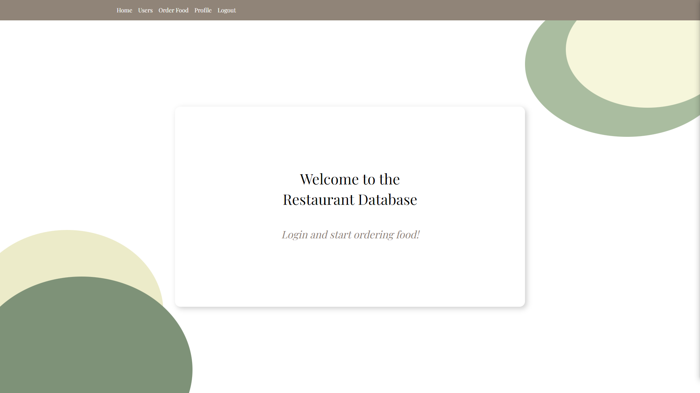

# Restaurant Database Project
A web application built with MongoDB that allows users to order food from available restaurants, view and edit their profiles, and view public users and their orders. 



## Running the server:
- open a terminal and run mongo daemon
- open another terminal and navigate to the project folder directory
- in the terminal run the following commands:
    ```
    npm install
    node database-initializer.js
    node server.js
    ```
    - NOTE: After running the database initializer, the terminal should print "10 users successfully added (should be 10)."

## Application Features:
### Navigation Bar
- The information contained in this header will vary depending on the current session state of the client
- If the client is logged in:
    - Home Page, Users Page, Order Form, User Profile, Logout
- If the client is not logged in
    - Home Page, Users Page, Login

### User Registration
- To register, the user must provide a username/password and click the register button
    - Duplicate usernames are not allowed
- New users are added to the database and are redirected to their profile 
- If the client enters in an existing username, an error message is displayed under the button 

### User Login
- To login, the user must enter in the credentials of an existing user in the db (e.g. pedro, pedro) and click the login button
    - The user is logged in and redirected to their profile page
- If the user enters the credentials of a non-existing user or incorrect credentials of an existing user, an error message is displayed under the button

### Orderform
- Users can select the restaurant to order from in the dropdown menu
- Add items to their cart using the + button beside the menu item
- Submit an order by clicking on the "Submit" button in the order summary

### Users Directory
- Click on "Users" in the header 
- A list of all public users is displayed 
- Query for a name: 
    - add a name query to the url (e.g. http://localhost:3000/users?name=a)
        - all public users with usernames that match the query should be displayed
        - query is case insensitive 

### User Profile Page
- Displays user's information and order history depending on their profile status (private user's cannot be accessed)

### Order Summary Page
- Logged in as user who placed the order / Public user's order
    - Shows order id, username of user who placed the order, the order itself (items and quantity),
      subtotal, tax, delivery fee, total 
- Private user (not logged in as them)
    - Error message saying user is private
